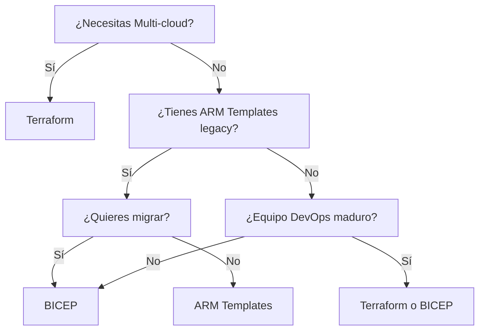

# 🎯 Guía Completa Azure: ARM vs BICEP vs Terraform

## 📋 Resumen del Proyecto

Este repositorio contiene **tres implementaciones equivalentes** de un sistema de pagos cloud-native en Azure, todas cumpliendo con las mismas Azure Policies organizacionales:

| **Implementación** | **Estado** | **Nivel** | **Cuándo Usar** |
|--------------------|------------|-----------|----------------|
| 🔷 **[BICEP](./azure-bicep-deployment/)** | ✅ **Completo con Guía Visual** | 🎓 **Principiante-Friendly** | ✅ Azure-only, sintaxis limpia |
| 🟦 **[Terraform](./azure-terraform-deployment/)** | ✅ **Completo con Guía Visual** | 🚀 **DevOps-Ready** | ✅ Multi-cloud, estado explícito |
| 📋 **[ARM Templates](./azure-arm-deployment/)** | ✅ Completo | 🏛️ **Enterprise/Legacy** | ✅ Control máximo, compliance extremo |

---

## 🏗️ Arquitectura Implementada (Idéntica en las 3)

```
┌─────────────────────────────────────────────────────────┐
│                    Internet                              │
└─────────────────┬───────────────────────────────────────┘
                  │
┌─────────────────▼───────────────────────────────────────┐
│              Application Gateway                         │
│           (Load Balancer + WAF)                         │
└─────────────────┬───────────────────────────────────────┘
                  │
┌─────────────────▼───────────────────────────────────────┐
│              Container Apps Environment                  │
│  ┌─────────────┐  ┌─────────────┐  ┌─────────────┐     │
│  │   Payment   │  │   Order     │  │   User      │     │
│  │   Service   │  │   Service   │  │   Service   │     │
│  └─────────────┘  └─────────────┘  └─────────────┘     │
└─────────────────┬───────────────────────────────────────┘
                  │
┌─────────────────▼───────────────────────────────────────┐
│              Azure Database for PostgreSQL              │
│                (Flexible Server)                        │
└─────────────────────────────────────────────────────────┘
```

### 🏷️ **Azure Policy Compliance** (100% en todas)
- ✅ **Required Tag**: `Project` en todos los recursos
- ✅ **Location Restriction**: Solo `canadacentral`
- ✅ **Governance Tags**: Environment, CostCenter, Owner, etc.

---

## 🚀 Inicio Rápido (3 opciones)

### 🔷 **Opción 1: BICEP (Recomendado para Azure-only)**

```bash
# 1. Ir al directorio BICEP
cd azure-bicep-deployment

# 2. Validar prerequisites  
./scripts/validate-guide-bicep.sh

# 3. Seguir guía visual paso a paso
open docs/GUIA-INGENIERO-BICEP-PASO-A-PASO.md
```

**⭐ Ventajas BICEP:**
- 🎨 **70% menos código** que ARM
- 🚀 **IntelliSense completo** en VS Code
- ✅ **Compila a ARM nativo**
- 📚 **Guía visual con checkpoints**

---

### 🟦 **Opción 2: Terraform (Recomendado para Multi-cloud)**

```bash
# 1. Ir al directorio Terraform
cd azure-terraform-deployment

# 2. Validar prerequisites
./scripts/validate-guide-terraform.sh

# 3. Seguir guía visual paso a paso  
open GUIA-INGENIERO-TERRAFORM-PASO-A-PASO.md
```

**⭐ Ventajas Terraform:**
- 🌍 **Multi-cloud** desde día 1
- 📊 **State management** explícito
- 🏗️ **Ecosistema maduro** de módulos
- 📚 **Guía visual con checkpoints**

---

### 📋 **Opción 3: ARM Templates (Enterprise/Legacy)**

```bash
# 1. Ir al directorio ARM
cd azure-arm-deployment

# 2. Ver documentación técnica
open README-detailed-implementation.md
```

**⭐ Ventajas ARM:**
- 🏛️ **Control granular** máximo
- ✅ **Azure nativo** 100%
- 🔧 **Casos específicos** cubiertos

---

## 📚 Guías de Aprendizaje Visual

### 🎓 **Para Principiantes (Con explicaciones detalladas)**

| **Herramienta** | **Guía Paso a Paso** | **Características** |
|-----------------|---------------------|-------------------|
| **BICEP** | [docs/GUIA-INGENIERO-BICEP-PASO-A-PASO.md](./azure-bicep-deployment/docs/GUIA-INGENIERO-BICEP-PASO-A-PASO.md) | ✅ **¿Qué estamos haciendo?**<br/>✅ **¿Por qué?**<br/>✅ **CHECKPOINT** validaciones<br/>✅ **APRENDIZAJE** conceptos<br/>✅ **LOGRO** celebraciones |
| **Terraform** | [GUIA-INGENIERO-TERRAFORM-PASO-A-PASO.md](./azure-terraform-deployment/GUIA-INGENIERO-TERRAFORM-PASO-A-PASO.md) | ✅ **¿Qué estamos haciendo?**<br/>✅ **¿Por qué?**<br/>✅ **CHECKPOINT** validaciones<br/>✅ **APRENDIZAJE** conceptos<br/>✅ **LOGRO** celebraciones |

### ⚡ **Para Desarrolladores Experimentados**

| **Herramienta** | **Referencia Rápida** | **Uso** |
|-----------------|----------------------|---------|
| **BICEP** | [docs/QUICK-REFERENCE-BICEP.md](./azure-bicep-deployment/docs/QUICK-REFERENCE-BICEP.md) | ✅ Comandos esenciales<br/>✅ Troubleshooting<br/>✅ Sintaxis vs ARM |
| **Terraform** | [QUICK-REFERENCE-TERRAFORM.md](./azure-terraform-deployment/QUICK-REFERENCE-TERRAFORM.md) | ✅ Comandos esenciales<br/>✅ State management<br/>✅ Módulos |

---

## 🎯 Guía de Decisión

### 📊 **¿Qué herramienta elegir?**



### 🏆 **Recomendaciones por Escenario**

| **Escenario** | **1ra Opción** | **2da Opción** | **Razón** |
|---------------|----------------|----------------|-----------|
| **Startup Azure-only** | 🔷 BICEP | 🟦 Terraform | Rapidez + IntelliSense |
| **Enterprise Multi-cloud** | 🟦 Terraform | 🔷 BICEP | Estrategia a largo plazo |
| **Migración desde ARM** | 🔷 BICEP | 📋 ARM | Migración automática |
| **DevOps Team** | 🟦 Terraform | 🔷 BICEP | State management |
| **Azure Compliance Extremo** | 📋 ARM | 🔷 BICEP | Control granular |

---

## 🧪 Validación y Testing

### ✅ **Scripts de Validación Disponibles**

```bash
# BICEP - Validar prerequisites y sintaxis
cd azure-bicep-deployment && ./scripts/validate-guide-bicep.sh

# Terraform - Validar prerequisites y plan
cd azure-terraform-deployment && ./scripts/validate-guide-terraform.sh

# ARM - Validar Azure Policy compliance
cd azure-arm-deployment && ./scripts/validate-arm-azure-policies.sh
```

### 🔍 **Todos validan:**
- ✅ **Prerequisites** (Azure CLI, herramientas específicas)
- ✅ **Sintaxis** de templates/código
- ✅ **Azure Policy compliance**
- ✅ **Integridad de archivos**

---

## 💰 Gestión de Costos

### 🧹 **Cleanup Testing (Todas las opciones)**

```bash
# Eliminar recursos de testing
az group delete --name "rg-PaymentSystem-dev" --yes --no-wait

# Terraform adicional: limpiar state
terraform destroy -var-file="environments/dev.tfvars" -auto-approve
```

### 📊 **Estimación de Costos**
- **Dev Environment**: ~$50-80/mes
- **Prod Environment**: ~$200-300/mes
- **💡 Tip**: Usar Azure Cost Management para monitoreo

---

## 🎓 Progresión de Aprendizaje

### 📅 **Roadmap Recomendado**

#### **Para principiantes en IaC:**
```
Día 1: Elegir herramienta según necesidades
Día 2-3: Completar guía visual paso a paso  
Semana 1: Deploy en dev environment
Semana 2: Personalizar para casos de uso específicos
Semana 3: Deploy a producción
```

#### **Para desarrolladores con experiencia:**
```
Día 1: Revisar COMPARISON-GUIDE.md
Día 1: Usar QUICK-REFERENCE para herramienta elegida
Día 2: Deploy y personalización
```

---

## 📖 Documentación Adicional

### 📚 **Documentos Clave**

| **Documento** | **Propósito** | **Audiencia** |
|---------------|---------------|---------------|
| [COMPARISON-GUIDE.md](./COMPARISON-GUIDE.md) | Comparación detallada ARM vs BICEP vs Terraform | Arquitectos, tomadores de decisiones |
| [optimized/](./optimized/) | Análisis de costos y optimizaciones | DevOps, FinOps |
| [example/](./example/) | Archivos ejemplo y fases del proyecto | Desarrolladores |

### 🌍 **Enlaces Útiles**
- **Azure BICEP**: https://docs.microsoft.com/azure/azure-resource-manager/bicep/
- **Terraform Azure Provider**: https://registry.terraform.io/providers/hashicorp/azurerm/
- **ARM Templates**: https://docs.microsoft.com/azure/azure-resource-manager/templates/
- **Azure Policies**: https://docs.microsoft.com/azure/governance/policy/

---

## 🎉 Características Especiales

### 🎨 **Metodología de Aprendizaje Visual**

Tanto BICEP como Terraform incluyen guías con:

- **✅ ¿Qué estamos haciendo?** - Explicación clara del objetivo
- **✅ ¿Por qué?** - Justificación pedagógica  
- **✅ CHECKPOINT** - Validación de comprensión
- **🎓 APRENDIZAJE** - Conceptos clave explicados
- **🎉 LOGRO** - Celebración de progreso

### 🏛️ **Azure Policy Compliance Nativo**

Todas las implementaciones incluyen:

- **🏷️ Tags obligatorios** aplicados automáticamente
- **🌍 Location restrictions** validadas
- **🔍 Scripts de validación** específicos por herramienta
- **📋 Governance tags** completos

### 🔄 **Multi-Environment Ready**

- **🧪 Dev Environment**: Configuración básica para testing
- **🏭 Prod Environment**: Configuración productiva escalable
- **📊 Parámetros diferenciados** por ambiente
- **🔧 Scripts de deploy** específicos

---

## 🚀 Próximos Pasos

### 🎯 **Empezar ahora:**

1. **📊 Leer comparación**: [COMPARISON-GUIDE.md](./COMPARISON-GUIDE.md)
2. **🎯 Elegir herramienta** según tus necesidades
3. **🧪 Validar prerequisites** con script correspondiente
4. **📚 Seguir guía visual** paso a paso
5. **🎉 Deploy tu primer sistema** cloud-native!

### 💡 **¿Tienes preguntas?**

- **BICEP**: Ver troubleshooting en `azure-bicep-deployment/docs/GUIA-INGENIERO-BICEP-PASO-A-PASO.md`
- **Terraform**: Ver troubleshooting en `azure-terraform-deployment/GUIA-INGENIERO-TERRAFORM-PASO-A-PASO.md`
- **ARM**: Ver documentación técnica en `azure-arm-deployment/README-detailed-implementation.md`

---

## 🏆 Resultado Final

Después de completar cualquiera de las guías tendrás:

- ✅ **Sistema de pagos** cloud-native funcionando
- ✅ **Azure Policy compliance** al 100%
- ✅ **Conocimiento práctico** de IaC en Azure
- ✅ **Configuración multi-ambiente** (dev/prod)
- ✅ **Scripts de validación** y troubleshooting
- ✅ **Mejor práctica de governance** implementadas

**🎉 ¡Disfruta construyendo infraestructura como código en Azure!**
