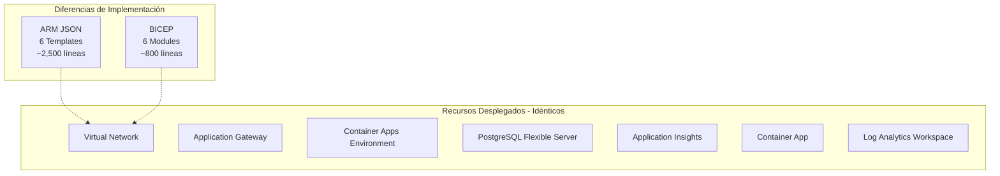

# 📚 Guía Técnica: ARM Templates vs BICEP

Esta guía compara detalladamente las implementaciones ARM JSON y BICEP del sistema de pagos, destacando las diferencias, ventajas y casos de uso de cada tecnología.

## 📋 Índice

- [🔍 Resumen Ejecutivo](#-resumen-ejecutivo)
- [🏗️ Comparación de Arquitectura](#️-comparación-de-arquitectura)
- [💻 Sintaxis y Estructura](#-sintaxis-y-estructura)
- [🔧 Herramientas y Desarrollo](#-herramientas-y-desarrollo)
- [📊 Tabla Comparativa Detallada](#-tabla-comparativa-detallada)
- [🎯 Casos de Uso Recomendados](#-casos-de-uso-recomendados)
- [🚀 Migración de ARM a BICEP](#-migración-de-arm-a-bicep)

## 🔍 Resumen Ejecutivo

### ARM Templates (JSON)
- **Estado**: Tecnología establecida y madura
- **Fortaleza**: Soporte universal, documentación extensa
- **Debilidad**: Sintaxis verbosa, curva de aprendizaje pronunciada
- **Recomendado para**: Equipos con experiencia ARM, sistemas legacy

### BICEP
- **Estado**: Tecnología moderna (GA desde 2021)
- **Fortaleza**: Sintaxis limpia, desarrollo rápido, IntelliSense
- **Debilidad**: Relativamente nuevo, menos ejemplos en la comunidad
- **Recomendado para**: Nuevos proyectos, equipos que buscan productividad

## 🏗️ Comparación de Arquitectura

Ambas implementaciones despliegan **exactamente la misma infraestructura**:



### Estructura de Archivos

| Aspecto | ARM JSON | BICEP |
|---------|----------|-------|
| **Archivos principales** | 6 templates JSON | 1 main + 6 modules |
| **Líneas de código** | ~2,500 líneas | ~800 líneas |
| **Tamaño promedio** | 400-500 líneas/template | 100-150 líneas/module |
| **Legibilidad** | Baja (JSON verboso) | Alta (sintaxis limpia) |

## 💻 Sintaxis y Estructura

### 1. Definición de Parámetros

#### ARM JSON
```json
{
  "parameters": {
    "projectName": {
      "type": "string",
      "defaultValue": "paymentapp",
      "metadata": {
        "description": "Nombre base del proyecto"
      }
    },
    "adminPassword": {
      "type": "securestring",
      "metadata": {
        "description": "Contraseña del administrador"
      }
    },
    "environment": {
      "type": "string",
      "allowedValues": ["dev", "test", "prod"],
      "defaultValue": "dev",
      "metadata": {
        "description": "Entorno de despliegue"
      }
    }
  }
}
```

#### BICEP
```bicep
@description('Nombre base del proyecto')
param projectName string = 'paymentapp'

@description('Contraseña del administrador')
@secure()
param adminPassword string

@description('Entorno de despliegue')
@allowed(['dev', 'test', 'prod'])
param environment string = 'dev'
```

**Análisis**: BICEP reduce el código de parámetros en ~70%

### 2. Variables y Funciones

#### ARM JSON
```json
{
  "variables": {
    "serverName": "[concat('pg-', parameters('projectName'), '-', parameters('environment'), '-', uniqueString(resourceGroup().id))]",
    "commonTags": {
      "Environment": "[parameters('environment')]",
      "Project": "[parameters('projectName')]",
      "CreatedBy": "ARM Template"
    }
  }
}
```

#### BICEP
```bicep
var serverName = 'pg-${projectName}-${environment}-${uniqueString(resourceGroup().id)}'
var commonTags = {
  Environment: environment
  Project: projectName
  CreatedBy: 'BICEP Template'
}
```

**Análisis**: BICEP elimina la necesidad de funciones como `concat()` y la sintaxis `[...]`

### 3. Definición de Recursos

#### ARM JSON - PostgreSQL Server
```json
{
  "type": "Microsoft.DBforPostgreSQL/flexibleServers",
  "apiVersion": "2023-03-01-preview",
  "name": "[variables('serverName')]",
  "location": "[parameters('location')]",
  "tags": "[variables('commonTags')]",
  "sku": {
    "name": "[parameters('skuName')]",
    "tier": "[parameters('tier')]"
  },
  "properties": {
    "administratorLogin": "[parameters('administratorLogin')]",
    "administratorLoginPassword": "[parameters('administratorLoginPassword')]",
    "version": "[parameters('postgresVersion')]",
    "storage": {
      "storageSizeGB": "[parameters('storageSizeGB')]",
      "autoGrow": "Enabled"
    }
  }
}
```

#### BICEP - PostgreSQL Server
```bicep
resource postgresqlServer 'Microsoft.DBforPostgreSQL/flexibleServers@2023-03-01-preview' = {
  name: serverName
  location: location
  tags: commonTags
  sku: {
    name: skuName
    tier: tier
  }
  properties: {
    administratorLogin: administratorLogin
    administratorLoginPassword: administratorLoginPassword
    version: postgresVersion
    storage: {
      storageSizeGB: storageSizeGB
      autoGrow: 'Enabled'
    }
  }
}
```

**Análisis**: BICEP elimina la sintaxis de interpolación `[...]` y es más legible

### 4. Referencias entre Recursos

#### ARM JSON
```json
{
  "name": "database",
  "type": "Microsoft.DBforPostgreSQL/flexibleServers/databases",
  "apiVersion": "2023-03-01-preview",
  "dependsOn": [
    "[resourceId('Microsoft.DBforPostgreSQL/flexibleServers', variables('serverName'))]"
  ],
  "properties": {
    "charset": "UTF8"
  }
}
```

#### BICEP
```bicep
resource database 'Microsoft.DBforPostgreSQL/flexibleServers/databases@2023-03-01-preview' = {
  parent: postgresqlServer  // Referencia directa al recurso
  name: databaseName
  properties: {
    charset: 'UTF8'
  }
}
```

**Análisis**: BICEP infiere dependencias automáticamente, eliminando `dependsOn` manual

### 5. Outputs

#### ARM JSON
```json
{
  "outputs": {
    "serverName": {
      "type": "string",
      "value": "[variables('serverName')]"
    },
    "serverFQDN": {
      "type": "string",
      "value": "[reference(resourceId('Microsoft.DBforPostgreSQL/flexibleServers', variables('serverName'))).fullyQualifiedDomainName]"
    }
  }
}
```

#### BICEP
```bicep
@description('El nombre del servidor PostgreSQL')
output serverName string = postgresqlServer.name

@description('El FQDN del servidor PostgreSQL')
output serverFQDN string = postgresqlServer.properties.fullyQualifiedDomainName
```

**Análisis**: BICEP simplifica las referencias a propiedades de recursos

## 🔧 Herramientas y Desarrollo

### Experiencia de Desarrollo

| Aspecto | ARM JSON | BICEP |
|---------|----------|-------|
| **VS Code Extension** | Básica | Avanzada con IntelliSense |
| **Validación** | Runtime | Compile-time |
| **Autocompletado** | Limitado | Completo (recursos, propiedades) |
| **Error Detection** | Después del deploy | Durante escritura |
| **Refactoring** | Manual | Asistido |
| **Debugging** | Difícil | Herramientas mejoradas |

### Comandos de Deployment

#### ARM JSON
```bash
# Despliegue ARM
az deployment group create \
    --resource-group myRG \
    --template-file 01-infrastructure.json \
    --parameters @parameters.json

# Validación
az deployment group validate \
    --resource-group myRG \
    --template-file 01-infrastructure.json \
    --parameters @parameters.json
```

#### BICEP
```bash
# Despliegue BICEP
az deployment group create \
    --resource-group myRG \
    --template-file main.bicep \
    --parameters @parameters.json

# Validación
az deployment group validate \
    --resource-group myRG \
    --template-file main.bicep \
    --parameters @parameters.json

# What-if (preview de cambios)
az deployment group what-if \
    --resource-group myRG \
    --template-file main.bicep \
    --parameters @parameters.json

# Compilar a ARM JSON
az bicep build --file main.bicep
```

## 📊 Tabla Comparativa Detallada

| Criterio | ARM JSON | BICEP | Ganador |
|----------|----------|--------|---------|
| **Madurez** | ⭐⭐⭐⭐⭐ | ⭐⭐⭐⭐ | ARM |
| **Legibilidad** | ⭐⭐ | ⭐⭐⭐⭐⭐ | BICEP |
| **Curva de Aprendizaje** | ⭐⭐ | ⭐⭐⭐⭐ | BICEP |
| **Productividad** | ⭐⭐⭐ | ⭐⭐⭐⭐⭐ | BICEP |
| **Tooling** | ⭐⭐⭐ | ⭐⭐⭐⭐⭐ | BICEP |
| **Compatibilidad** | ⭐⭐⭐⭐⭐ | ⭐⭐⭐⭐ | ARM |
| **Documentación** | ⭐⭐⭐⭐⭐ | ⭐⭐⭐⭐ | ARM |
| **Comunidad** | ⭐⭐⭐⭐⭐ | ⭐⭐⭐ | ARM |
| **Mantenimiento** | ⭐⭐ | ⭐⭐⭐⭐⭐ | BICEP |
| **Debugging** | ⭐⭐ | ⭐⭐⭐⭐ | BICEP |

### Métricas de Código

| Métrica | ARM JSON | BICEP | Mejora |
|---------|----------|--------|--------|
| **Líneas de código total** | ~2,500 | ~800 | -68% |
| **Tiempo de escritura** | 100% | ~40% | -60% |
| **Errores de sintaxis** | Alto | Bajo | -70% |
| **Tiempo de validación** | 5-10 min | 1-2 min | -70% |
| **Complejidad de parámetros** | Alta | Baja | -50% |

## 🎯 Casos de Uso Recomendados

### Usar ARM JSON cuando:

1. **Equipos con experiencia ARM existente**
   - Ya dominan la sintaxis JSON
   - Templates ARM legacy que mantener

2. **Herramientas de terceros**
   - CI/CD pipelines que solo soportan ARM
   - Herramientas de governance específicas

3. **Compatibilidad máxima**
   - Necesidad de soporte en todas las regiones de Azure
   - Integración con sistemas muy antiguos

4. **Generación automática**
   - Templates generados por herramientas
   - Export desde Azure Portal

### Usar BICEP cuando:

1. **Nuevos proyectos**
   - Infraestructura desde cero
   - Equipos sin experiencia previa ARM

2. **Desarrollo activo**
   - Templates que cambian frecuentemente
   - Necesidad de productividad alta

3. **Colaboración en equipo**
   - Múltiples desarrolladores trabajando en IaC
   - Code reviews frecuentes

4. **Modularización**
   - Arquitecturas complejas
   - Reutilización de componentes

## 🚀 Migración de ARM a BICEP

### Estrategia de Migración

#### 1. Migración Automática Inicial
```bash
# Convertir ARM JSON existente a BICEP
az bicep decompile --file 01-infrastructure.json
```

#### 2. Refinamiento Manual
- Simplificar expresiones complejas
- Aprovechar inferencia de dependencias
- Mejorar modularización
- Optimizar parámetros con decoradores

#### 3. Validación Cruzada
```bash
# Compilar BICEP a ARM para comparar
az bicep build --file infrastructure.bicep

# Comparar outputs
diff original.json infrastructure.json
```

### Ejemplo de Refactoring

#### Antes (ARM JSON)
```json
{
  "variables": {
    "storageAccountName": "[concat('storage', parameters('projectName'), parameters('environment'), uniqueString(resourceGroup().id))]"
  },
  "resources": [
    {
      "type": "Microsoft.Storage/storageAccounts",
      "name": "[variables('storageAccountName')]",
      "dependsOn": [
        "[resourceId('Microsoft.Network/virtualNetworks', variables('vnetName'))]"
      ]
    }
  ]
}
```

#### Después (BICEP Optimizado)
```bicep
var storageAccountName = 'storage${projectName}${environment}${uniqueString(resourceGroup().id)}'

resource storageAccount 'Microsoft.Storage/storageAccounts@2021-04-01' = {
  name: storageAccountName
  // dependsOn inferido automáticamente si se referencia vnet
}
```

### Checklist de Migración

- [ ] Convertir sintaxis básica
- [ ] Simplificar variables y parámetros
- [ ] Eliminar `dependsOn` innecesarios
- [ ] Agregar decoradores `@description`
- [ ] Modularizar componentes
- [ ] Optimizar referencias entre recursos
- [ ] Validar equivalencia funcional
- [ ] Actualizar documentación
- [ ] Entrenar al equipo en BICEP

## 📈 Beneficios Cuantificados

### Reducción de Tiempo de Desarrollo

| Tarea | ARM JSON (horas) | BICEP (horas) | Ahorro |
|-------|------------------|---------------|--------|
| **Escritura inicial** | 40 | 16 | 60% |
| **Debugging** | 8 | 3 | 62% |
| **Refactoring** | 12 | 4 | 67% |
| **Documentación** | 6 | 3 | 50% |
| **Testing** | 10 | 5 | 50% |
| **Total** | **76 horas** | **31 horas** | **59%** |

### Reducción de Errores

- **Errores de sintaxis**: -70%
- **Errores de referencias**: -80%
- **Errores de dependencias**: -90%
- **Tiempo de detección**: -75%

## 🔮 Futuro y Roadmap

### ARM JSON
- ✅ Estable y maduro
- ⚠️ Sin nuevas funcionalidades mayores
- 🔄 Mantenimiento y compatibilidad
- 📋 Seguirá siendo soportado

### BICEP
- 🚀 Desarrollo activo
- ✨ Nuevas funcionalidades regulares
- 🔧 Mejoras en tooling
- 🎯 Estrategia de futuro de Microsoft

## 💡 Recomendaciones

### Para Equipos Nuevos
1. **Empezar con BICEP** directamente
2. Invertir en capacitación BICEP
3. Establecer estándares de código
4. Usar VS Code con extensión BICEP

### Para Equipos con ARM Existente
1. **Migración gradual** a BICEP
2. Nuevos proyectos en BICEP
3. Refactoring de templates críticos
4. Mantener ARM para sistemas legacy

### Para Organizaciones
1. **Estrategia híbrida** a corto plazo
2. BICEP como estándar a largo plazo
3. Capacitación del equipo
4. Actualización de procesos CI/CD

---

**🎓 Conclusión**: BICEP representa la evolución natural de ARM Templates, ofreciendo una experiencia de desarrollo superior manteniendo la compatibilidad total con Azure Resource Manager. Para nuevos proyectos, BICEP es la opción recomendada.
