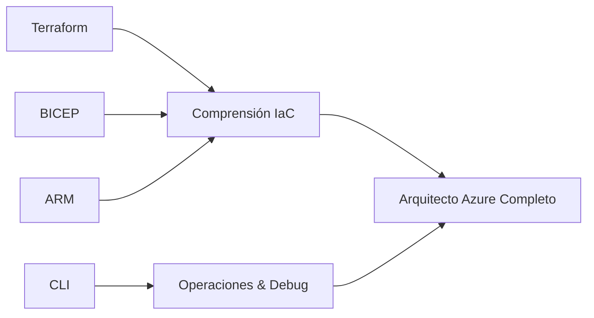

# Azure CLI Scripts - Sistema de Pagos

## 🎯 Propósito del Proyecto

Esta carpeta contiene scripts de **Azure CLI** para implementar un sistema de pagos con **metodología de aprendizaje visual**. Complementa los otros enfoques (Terraform, BICEP, ARM) con una aproximación **imperativa** que es ideal para:

- **Debugging y troubleshooting** paso a paso
- **Automatización de operaciones** específicas  
- **Comprensión granular** de cada recurso
- **Implementación modular** y flexible

## 📂 Estructura del Proyecto

```
azure-cli-scripts/
├── docs/
│   ├── GUIA-CLI-PASO-A-PASO.md         # Guía principal con metodología visual
│   └── QUICK-REFERENCE-CLI.md           # Referencia rápida de comandos
├── scripts/
│   ├── 01-setup-environment.sh         # Configuración inicial
│   ├── 02-create-networking.sh         # Red y subnets
│   ├── 03-create-database.sh           # Base de datos PostgreSQL
│   ├── 04-create-container-env.sh      # Container Apps Environment
│   ├── 05-create-monitoring.sh         # Log Analytics y App Insights
│   ├── 06-deploy-applications.sh       # Aplicaciones containerizadas
│   ├── 07-create-app-gateway.sh        # Application Gateway
│   ├── 98-troubleshoot.sh              # Scripts de debugging
│   └── 99-cleanup.sh                   # Limpieza completa
├── parameters/
│   └── dev.env                         # Variables de entorno
└── README.md                           # Este archivo
```

## 🚀 Inicio Rápido para Ingenieros Junior

### 🧙‍♂️ OPCIÓN RECOMENDADA: Wizard Interactivo
**¿Primera vez con Azure CLI?** ¡Usa nuestro wizard que te guía paso a paso!

```bash
./scripts/wizard.sh
```

El wizard:
- ✅ Te explica cada paso antes de ejecutarlo
- ✅ Verifica prerequisites automáticamente  
- ✅ Te permite pausar/continuar cuando quieras
- ✅ Maneja errores de forma amigable
- ✅ Muestra tu progreso en tiempo real

### ⚡ OPCIÓN MANUAL: Paso a Paso

Si prefieres control total, sigue este orden exacto:

1. **🔍 PRIMER PASO OBLIGATORIO** - Verifica que todo esté listo:
   ```bash
   ./scripts/00-debug-setup.sh
   ```

2. **📖 LEE LA GUÍA COMPLETA** antes de ejecutar nada:
   ```bash
   # Abre la guía principal
   cat docs/GUIA-CLI-PASO-A-PASO.md
   ```

3. **⚡ Si tienes problemas**, consulta la guía de troubleshooting:
   ```bash
   # Guía específica para ingenieros junior
   cat docs/TROUBLESHOOTING-JUNIOR.md
   ```

### 🎯 Implementación Paso a Paso

```bash
# Paso 0: SIEMPRE ejecuta esto primero
./scripts/00-debug-setup.sh

# Solo si el debug pasa ✅, continúa:

# Paso 1: Configuración inicial
./scripts/01-setup-environment.sh

# Paso 2: Crear networking
./scripts/02-create-networking.sh

# Paso 3: Crear base de datos
./scripts/03-create-database.sh

# Paso 4: Container Apps Environment
./scripts/04-create-container-env.sh

# Paso 5: Monitoring
./scripts/05-create-monitoring.sh

# Paso 6: Aplicaciones
./scripts/06-deploy-applications.sh

# Paso 7: Application Gateway
./scripts/07-create-app-gateway.sh

# ¿Problemas? Usa herramientas de debugging:
./scripts/98-troubleshoot.sh

# Al terminar, limpia recursos:
./scripts/99-cleanup.sh
```

### 🆘 ¿Tienes un Error?

**NO PÁNIQUES** 😊 - Todos los errores tienen solución:

1. **Ejecuta el script de debug:**
   ```bash
   ./scripts/00-debug-setup.sh
   ```

2. **Verifica tu progreso:**
   ```bash
   ./scripts/check-progress.sh
   ```

3. **Consulta la guía de troubleshooting:**
   ```bash
   cat docs/TROUBLESHOOTING-JUNIOR.md
   ```

4. **Usa herramientas de debugging:**
   ```bash
   ./scripts/98-troubleshoot.sh
   ```

### 📚 Guías Disponibles

| Archivo | Propósito | Cuándo Usarlo |
|---------|-----------|---------------|
| `README.md` | Esta guía de inicio | **SIEMPRE primero** |
| `docs/GUIA-CLI-PASO-A-PASO.md` | Guía completa con explicaciones | Para aprender conceptos |
| `docs/TROUBLESHOOTING-JUNIOR.md` | Solución de problemas | Cuando algo falla |
| `docs/QUICK-REFERENCE-CLI.md` | Comandos de referencia | Para consulta rápida |

### 🔧 Scripts de Utilidad

| Script | Cuándo Usar |
|--------|-------------|
| `./scripts/00-debug-setup.sh` | **ANTES** de empezar cualquier implementación |
| `./scripts/check-progress.sh` | **DURANTE** la implementación para ver progreso |
| `./scripts/98-troubleshoot.sh` | **CUANDO** algo no funciona como esperado |

## 🎓 Para Ingenieros Experimentados

Si ya conoces Azure CLI, puedes usar el flujo rápido:
## 🎓 Para Ingenieros Experimentados

Si ya conoces Azure CLI, puedes usar el flujo rápido:

### 1. Preparar el entorno
```bash
# Cargar variables de entorno
source parameters/dev.env

# Verificar login en Azure
az account show
```

### 2. Ejecutar scripts modulares
### 2. Ejecutar scripts modulares
```bash
# Paso 1: Configuración inicial
./scripts/01-setup-environment.sh

# Paso 2: Crear networking
./scripts/02-create-networking.sh

# Paso 3: Crear base de datos
./scripts/03-create-database.sh

# ... continuar con los demás scripts
```

### 3. Para estudiantes - Guía completa
👉 **Ve a [GUIA-CLI-PASO-A-PASO.md](docs/GUIA-CLI-PASO-A-PASO.md)** para la experiencia de aprendizaje completa con metodología visual.

## 📋 Scripts Disponibles

| Script | Propósito | Tiempo estimado |
|--------|-----------|----------------|
| `wizard.sh` | **🧙‍♂️ WIZARD INTERACTIVO** (Recomendado para junior) | 45 min |
| `00-debug-setup.sh` | **VERIFICAR PREREQUISITES** | 2 min |
| `01-setup-environment.sh` | Crear resource group y validaciones | 2 min |
| `02-create-networking.sh` | VNet, subnets, NSGs | 5 min |
| `03-create-database.sh` | PostgreSQL Flexible Server | 8 min |
| `04-create-container-env.sh` | Container Apps Environment | 6 min |
| `05-create-monitoring.sh` | Log Analytics, App Insights | 4 min |
| `06-deploy-applications.sh` | Container Apps | 7 min |
| `07-create-app-gateway.sh` | Application Gateway | 10 min |
| `check-progress.sh` | **VERIFICAR TU PROGRESO** | 1 min |
| `98-troubleshoot.sh` | Herramientas de debugging | - |
| `99-cleanup.sh` | Limpieza completa | 3 min |

## 🎓 Características de Aprendizaje

Este proyecto implementa la misma **metodología visual** exitosa de Terraform y BICEP:

- **"¿Qué estamos haciendo?"** - Contexto claro en cada paso
- **"¿Por qué?"** - Explicación de decisiones técnicas
- **CHECKPOINT** - Validaciones y verificaciones
- **APRENDIZAJE** - Conceptos técnicos explicados
- **LOGRO** - Confirmación de progreso

## 🔧 Ventajas del Enfoque CLI

### vs. IaC Declarativo (Terraform/BICEP/ARM)
- ✅ **Debugging granular** - Ver cada comando individual
- ✅ **Operaciones específicas** - Ejecutar solo lo que necesitas
- ✅ **Comprensión paso a paso** - Entender cada recurso
- ✅ **Flexibilidad total** - Modificar en tiempo real

### Casos de uso ideales
- **Troubleshooting** de recursos específicos
- **Automatización** de tareas operativas
- **Aprendizaje** de la CLI de Azure
- **Prototipado** rápido de soluciones

## 🔄 Integración con otros enfoques

Este proyecto CLI **complementa** (no reemplaza) los otros enfoques:



## 📚 Recursos Adicionales

- **Terraform**: `../terraform-azure-container-apps/`
- **BICEP**: `../bicep-azure-container-apps/`
- **ARM**: `../azure-arm-deployment/`
- **Documentación Azure CLI**: https://docs.microsoft.com/cli/azure/

## ⚠️ Consideraciones Importantes

### Seguridad
- ⚠️ Las contraseñas en `dev.env` son de ejemplo
- 🔒 Usar Azure Key Vault en producción
- 🛡️ Configurar RBAC apropiado

### Costos
- 💰 Los scripts crean recursos que generan costos
- 🧹 Usar `99-cleanup.sh` para limpiar recursos
- 📊 Monitorear costos en Azure Portal

### Prerrequisitos
- Azure CLI instalado y actualizado
- Subscription de Azure activa
- Permisos de Contributor o Owner

---

## 🤝 Contribuciones

Este proyecto sigue la metodología de aprendizaje establecida. Al contribuir:

1. Mantener la estructura de "¿Qué? ¿Por qué?"
2. Incluir checkpoints y validaciones
3. Explicar conceptos técnicos (APRENDIZAJE)
4. Confirmar logros alcanzados

---

**¡Empieza tu aprendizaje CLI!** 👉 [GUIA-CLI-PASO-A-PASO.md](docs/GUIA-CLI-PASO-A-PASO.md)
